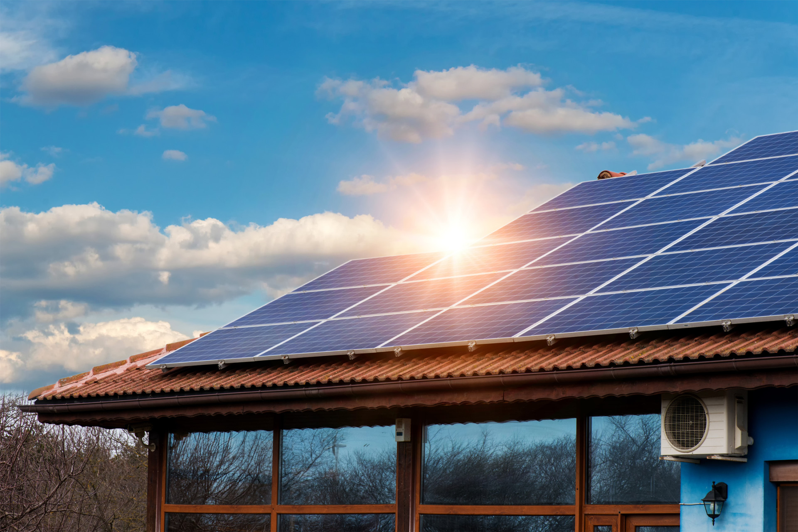

 

El sector de l’autoconsum fotovoltaic a Catalunya ha crescut de manera molt significativa des de l'any 2019, a conseqüència de l’aprovació d’un marc legal més favorable (en paraules simples, la derogació de l'impost al sol).  Aquesta aplicació interactiva en format [shiny](https://shiny.rstudio.com/) permet **visualitzar l'evolució de l'autoconsum energètic a Catalunya des de l'any 2017 i relacionar-ho amb variables demogràfiques, polítiques i econòmiques**. L'objectiu és fer servir la ciència de dades per entendre quines d'aquestes variables són els factors més limitants i així poder ajudar a les institucions a prendre decisions per impulsar l'autoconsum energètic a Catalunya.

 

#### Notes i aspectes a millorar

- Per simplificar l'ànalisi, m'he centrat en l'instal·lació de plaques solars fotovoltàiques d'una potencia menor de 100Kwh (i.e. d'autoconsum).  
- Hi ha molts municipis on falta informació sobre la bonificacó de l'IBI.  
- L'anàlisi socioeconòmic només ha estat possible amb municipis de cert tamany.  

#### Fonts de les dades

Les dades han sigut descarregades des dels següents enllaços:  
- [Bonificació IBI per municipi](http://icaen.gencat.cat/ca/energia/autoconsum/autoconsum-fotovoltaic/cercador-de-municipis-amb-bonificacions-per-a-lautoconsum/)  
- [Població per municipi](https://analisi.transparenciacatalunya.cat/en/Demografia/Poblaci-de-Catalunya-per-municipi-rang-d-edat-i-se/b4rr-d25b)  
- [Població per comarca](https://www.idescat.cat/pub/?id=aec&n=249&lang=es)  
- [Pes d'habitatge unifamiliar per municipi](https://www.idescat.cat/pub/?id=censph&n=308&by=mun&t=200100)
- [PIB per comarca](https://www.idescat.cat/pub/?id=aec&n=358)  
- [PIB per municipi](https://www.idescat.cat/pub/?id=pibc&n=13830&by=mun&t=201800)
- [Mapa de catalunya](https://territori.gencat.cat/ca/06_territori_i_urbanisme/observatori_territori/mapa_urbanistic_de_catalunya/serveis_web_i_dades_obertes/descarrega-de-dades/format-shapefile-shp/)  

#### Agraïments

Dono gràcies a la Paula Rodriguez i al David Villar per inspirar-me amb el seu [informe d'autoconsum energètic](http://icaen.gencat.cat/web/.content/10_ICAEN/17_publicacions_informes/08_guies_informes_estudis/informes_i_estudis/arxius/20200831_InformeAutoconsumFV.pdf) i per proporcionar-me dades.

#### Contact

Ricard Argelaguet (ricard.argelaguet@gmail.com)

